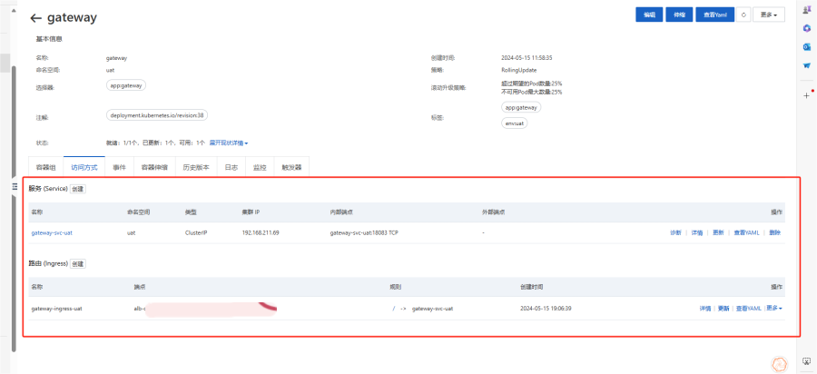
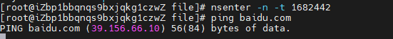

# ACK使用指南

## 容器概念

### 容器

容器是应用程序每个组件的独立进程。每个组件（前端 React 应用程序、Python API 引擎和数据库）都在其自己的独立环境中运行，与计算机上的所有其他组件完全隔离。

这就是容器的神奇之处。容器具有以下特点：

- 自包含。每个容器都具有其运行所需的一切，并且不依赖于主机上任何预安装的依赖项。

隔离。由于容器是独立运行的，因此它们对主机和其他容器的影响很小，从而提高了应用程序的安全性。

- 独立。每个容器都是独立管理的。删除一个容器不会影响其他容器。
- 可移植。容器可以在任何地方运行！在您的开发机器上运行的容器将在数据中心或云中的任何地方以相同的方式工作！

#### cgroup

用来控制进程组对各种资源的使用。

#### namespace

Linux提供的一种内核级别环境隔离的方法。

基于cgroup和namespace实现一个轻量级的操作系统环境，类似于沙箱。

### [容器与虚拟机 (VM)](https://docs.docker.com/guides/docker-concepts/the-basics/what-is-a-container/"%20\l%20"containers-versus-virtual-machines-vms)

简单来说，虚拟机是一个完整的操作系统，拥有自己的内核、硬件驱动程序、程序和应用程序。启动虚拟机只是为了隔离单个应用程序，这会带来很大的开销。

容器只是一个独立的进程，其中包含运行所需的所有文件。如果您运行多个容器，它们都共享同一个内核，这样您就可以在更少的基础设施上运行更多的应用程序。

### 镜像

容器镜像是一个标准化包，其中包含运行容器所需的所有文件、二进制文件、库和配置。

镜像有两个重要原则：

- 镜像是不可变的。镜像一旦创建，就无法修改。您只能创建新镜像或在其上进行修改。
- 容器镜像由层组成。每层代表一组添加、删除或修改文件的文件系统操作。

打包好的程序，包含了程序运行时所需要的所有环境

## Kubernetes架构


## 名词解释

| 阿里云ACK | kubernetes |
| --- | --- |
| 命名空间 | Namespace |
| 无状态 | Deployment |
| 有状态 | StatefulSet |
| 守护进程集 | DaemonSet |
| 任务  | Job |
| 定时任务 | CronJob |
| 容器组 | Pod |
| 自定义资源 | [CustomResourceDefinition](https://kubernetes.io/docs/reference/generated/kubernetes-api/v1.30/"%20\l%20"customresourcedefinition-v1-apiextensions-k8s-io) |
| 服务  | Service |
| 路由  | Ingress |
| 配置项 | ConfigMap |
| 保密字典 | Secret |
| 存储声明 | PersistentVolumeClaim |
| 存储卷 | PersistentVolume |
| 存储类 | StorageClass |
| Helm | Helm |
| 服务网格 | ServiceMesh |

### 镜像拉取策略

- IfNotPresent

只有当镜像在本地不存在时才会拉取。没有就拉取

- Always

每当 kubelet 启动一个容器时，kubelet 会查询容器的镜像仓库， 将名称解析为一个镜像[摘要](https://docs.docker.com/engine/reference/commandline/pull/"%20\l%20"pull-an-image-by-digest-immutable-identifier)。 如果 kubelet 有一个容器镜像，并且对应的摘要已在本地缓存，kubelet 就会使用其缓存的镜像； 否则，kubelet 就会使用解析后的摘要拉取镜像，并使用该镜像来启动容器。每次都拉取

- Never

kubelet 不会尝试获取镜像。如果镜像已经以某种方式存在本地， kubelet 会尝试启动容器；否则，会启动失败。只要能够可靠地访问镜像仓库，底层镜像提供者的缓存语义甚至可以使 imagePullPolicy: Always 高效。 你的容器运行时可以注意到节点上已经存在的镜像层，这样就不需要再次下载。永远不拉取

### Namespace

提供一种机制，将同一集群中的资源划分为相互隔离的组。 同一名字空间内的资源名称要唯一，但跨名字空间时没有这个要求。 名字空间作用域仅针对带有名字空间的[对象](https://kubernetes.io/zh-cn/docs/concepts/overview/working-with-objects/"%20\l%20"kubernetes-objects"%20\o%20""%20\t%20"https://kubernetes.io/zh-cn/docs/concepts/overview/working-with-objects/namespaces/_blank)， （例如 Deployment、Service 等），这种作用域对集群范围的对象 （例如 StorageClass、Node、PersistentVolume 等）不适用。

对指定的资源类型进行隔离，达到资源分离、互不影响的目的。

### Deployment

&nbsp; 是在集群上运行应用的最常见方式。Deployment 适合在集群上管理无状态应用工作负载， 其中 Deployment 中的任何 Pod 都是可互换的，可以在需要时进行替换。

进程集，用于管理无状态的程序Pod集合，每个进程的行为是一致的。

### StatefulSet

管理一个或多个运行相同应用代码、但具有不同身份标识的 Pod。 StatefulSet 与 Deployment 不同。Deployment 中的 Pod 预期是可互换的。 StatefulSet 最常见的用途是能够建立其 Pod 与其持久化存储之间的关联。 例如，你可以运行一个将每个 Pod 关联到 [PersistentVolume](https://kubernetes.io/zh-cn/docs/concepts/storage/persistent-volumes/) 的 StatefulSet。如果该 StatefulSet 中的一个 Pod 失败了，Kubernetes 将创建一个新的 Pod， 并连接到相同的 PersistentVolume。

具有状态的进程集，其本身依赖于其它资源，需要匹配绑定才能使用，如果失去绑定的资源则本身发生了变化，程序运行结果可能会改变。

### DaemonSet

定义了在特定[节点](https://kubernetes.io/zh-cn/docs/concepts/architecture/nodes/"%20\o%20""%20\t%20"https://kubernetes.io/zh-cn/docs/concepts/workloads/controllers/_blank)上提供本地设施的 Pod， 例如允许该节点上的容器访问存储系统的驱动。当必须在合适的节点上运行某种驱动或其他节点级别的服务时，你可以使用 DaemonSet。DaemonSet 中的每个 Pod 执行类似于经典 Unix / POSIX 服务器上的系统守护进程的角色。DaemonSet 可能对集群的操作至关重要， 例如作为插件让该节点访问[集群网络](https://kubernetes.io/zh-cn/docs/concepts/cluster-administration/networking/"%20\l%20"how-to-implement-the-kubernetes-network-model)， 也可能帮助你管理节点，或者提供增强正在运行的容器平台所需的、不太重要的设施。 你可以在集群的每个节点上运行 DaemonSets（及其 Pod），或者仅在某个子集上运行 （例如，只在安装了 GPU 的节点上安装 GPU 加速驱动）。

守护进程集，提供基础服务能力，类似于安卓的Service、Broadcast等。对于程序应用一般用不到。

### Job

Job 会创建一个或者多个 Pod，并将继续重试 Pod 的执行，直到指定数量的 Pod 成功终止。 随着 Pod 成功结束，Job 跟踪记录成功完成的 Pod 个数。 当数量达到指定的成功个数阈值时，任务（即 Job）结束。 删除 Job 的操作会清除所创建的全部 Pod。 挂起 Job 的操作会删除 Job 的所有活跃 Pod，直到 Job 被再次恢复执行。

一次性任务，类似于安装一个软件，过程只会执行一次，执行成功则结束。Helm安装软件的过程就是这样。

### CronJob

CronJob 用于执行排期操作，例如备份、生成报告等。 一个 CronJob 对象就像 Unix 系统上的 crontab（cron table）文件中的一行。 它用 [Cron](https://zh.wikipedia.org/wiki/Cron) 格式进行编写， 并周期性地在给定的调度时间执行 Job。

CronJob 有所限制，也比较特殊。 例如在某些情况下，单个 CronJob 可以创建多个并发任务。 请参阅下面的[限制](https://kubernetes.io/zh-cn/docs/concepts/workloads/controllers/cron-jobs/"%20\l%20"cron-job-limitations)。

当控制平面为 CronJob 创建新的 Job 和（间接）Pod 时，CronJob 的 .metadata.name 是命名这些 Pod 的部分基础。 CronJob 的名称必须是一个合法的 [DNS 子域](https://kubernetes.io/zh-cn/docs/concepts/overview/working-with-objects/names/"%20\l%20"dns-subdomain-names)值， 但这会对 Pod 的主机名产生意外的结果。为获得最佳兼容性，名称应遵循更严格的 [DNS 标签](https://kubernetes.io/zh-cn/docs/concepts/overview/working-with-objects/names"%20\l%20"dns-label-names)规则。 即使名称是一个 DNS 子域，它也不能超过 52 个字符。这是因为 CronJob 控制器将自动在你所提供的 Job 名称后附加 11 个字符，并且存在 Job 名称的最大长度不能超过 63 个字符的限制。

定时任务，周期性执行指定的指令。

### Pod

Pod 是可以在 Kubernetes 中创建和管理的、最小的可部署的计算单元。

Pod是一组（一个或多个） [容器](https://kubernetes.io/zh-cn/docs/concepts/containers/"%20\o%20""%20\t%20"https://kubernetes.io/zh-cn/docs/concepts/workloads/pods/_blank)； 这些容器共享存储、网络、以及怎样运行这些容器的声明。 Pod 中的内容总是并置（colocated）的并且一同调度，在共享的上下文中运行。 Pod 所建模的是特定于应用的 “逻辑主机”，其中包含一个或多个应用容器， 这些容器相对紧密地耦合在一起。 在非云环境中，在相同的物理机或虚拟机上运行的应用类似于在同一逻辑主机上运行的云应用。

除了应用容器，Pod 还可以包含在 Pod 启动期间运行的 [Init 容器](https://kubernetes.io/zh-cn/docs/concepts/workloads/pods/init-containers/"%20\o%20""%20\t%20"https://kubernetes.io/zh-cn/docs/concepts/workloads/pods/_blank)。 你也可以注入[临时性容器](https://kubernetes.io/zh-cn/docs/concepts/workloads/pods/ephemeral-containers/"%20\o%20""%20\t%20"https://kubernetes.io/zh-cn/docs/concepts/workloads/pods/_blank)来调试正在运行的 Pod。

一个进程，执行镜像中的代码，对集群内提供服务。有一个专属的网段，每个程序都会在该网段范围内分配一个ip以及一个唯一的hostname，程序可能并不在同一个机器上。所有pod进程间通过ip进行访问。

### CustomResource

资源（Resource） 是 [Kubernetes API](https://kubernetes.io/zh-cn/docs/concepts/overview/kubernetes-api/) 中的一个端点， 其中存储的是某个类别的 [API 对象](https://kubernetes.io/zh-cn/docs/concepts/overview/working-with-objects/"%20\l%20"kubernetes-objects"%20\o%20""%20\t%20"https://kubernetes.io/zh-cn/docs/concepts/extend-kubernetes/api-extension/custom-resources/_blank)的一个集合。 例如内置的 Pod 资源包含一组 Pod 对象。

定制资源（Custom Resource） 是对 Kubernetes API 的扩展，不一定在默认的 Kubernetes 安装中就可用。定制资源所代表的是对特定 Kubernetes 安装的一种定制。 不过，很多 Kubernetes 核心功能现在都用定制资源来实现，这使得 Kubernetes 更加模块化。

定制资源可以通过动态注册的方式在运行中的集群内或出现或消失，集群管理员可以独立于集群更新定制资源。 一旦某定制资源被安装，用户可以使用 [kubectl](https://kubernetes.io/zh-cn/docs/reference/kubectl/"%20\o%20""%20\t%20"https://kubernetes.io/zh-cn/docs/concepts/extend-kubernetes/api-extension/custom-resources/_blank) 来创建和访问其中的对象，就像他们为 Pod 这种内置资源所做的一样。

k8s内置资源类型以外的资源，可以通过[CustomResourceDefinition](https://kubernetes.io/docs/reference/generated/kubernetes-api/v1.30/"%20\l%20"customresourcedefinition-v1-apiextensions-k8s-io)进行使用。

### [CustomResourceDefinition](https://kubernetes.io/docs/reference/generated/kubernetes-api/v1.30/"%20\l%20"customresourcedefinition-v1-apiextensions-k8s-io)

对[Kubernetes](https://kubernetes.io/zh-cn/docs/tasks/extend-kubernetes/)的扩展，用于在集群中使用自定义资源（CustomResource）

用于使用CustomResource

### Service

Kubernetes 中 Service 是 将运行在一个或一组 [Pod](https://kubernetes.io/zh-cn/docs/concepts/workloads/pods/"%20\o%20""%20\t%20"https://kubernetes.io/zh-cn/docs/concepts/services-networking/service/_blank) 上的网络应用程序公开为网络服务的方法。

Kubernetes 中 Service 的一个关键目标是让你无需修改现有应用以使用某种不熟悉的服务发现机制。 你可以在 Pod 集合中运行代码，无论该代码是为云原生环境设计的，还是被容器化的老应用。 你可以使用 Service 让一组 Pod 可在网络上访问，这样客户端就能与之交互。

用于对外暴露Pod的能力，拥有自己的ip和端口。请求到此服务的流量会通过Selector标签对Pod进行匹配，然后将流量转发到符合标签的Pod中。

### Ingress

[Ingress](https://kubernetes.io/docs/reference/generated/kubernetes-api/v1.30/"%20\l%20"ingress-v1-networking-k8s-io) 提供从集群外部到集群内[服务](https://kubernetes.io/zh-cn/docs/concepts/services-networking/service/)的 HTTP 和 HTTPS 路由。 流量路由由 Ingress 资源所定义的规则来控制。

流量转发规则，类似于nginx。

### ConfigMap

ConfigMap 是一种 API 对象，用来将非机密性的数据保存到键值对中。使用时， [Pod](https://kubernetes.io/zh-cn/docs/concepts/workloads/pods/"%20\o%20""%20\t%20"https://kubernetes.io/zh-cn/docs/concepts/configuration/configmap/_blank) 可以将其用作环境变量、命令行参数或者存储卷中的配置文件。

ConfigMap 将你的环境配置信息和[容器镜像](https://kubernetes.io/zh-cn/docs/reference/glossary/?all=true"%20\l%20"term-image"%20\o%20""%20\t%20"https://kubernetes.io/zh-cn/docs/concepts/configuration/configmap/_blank)解耦，便于应用配置的修改。

K-V配置存储，类似于redis的String。

### Secret

Secret 是一种包含少量敏感信息例如密码、令牌或密钥的对象。 这样的信息可能会被放在 [Pod](https://kubernetes.io/zh-cn/docs/concepts/workloads/pods/"%20\o%20""%20\t%20"https://kubernetes.io/zh-cn/docs/concepts/configuration/secret/_blank) 规约中或者镜像中。 使用 Secret 意味着你不需要在应用程序代码中包含机密数据。

由于创建 Secret 可以独立于使用它们的 Pod， 因此在创建、查看和编辑 Pod 的工作流程中暴露 Secret（及其数据）的风险较小。 Kubernetes 和在集群中运行的应用程序也可以对 Secret 采取额外的预防措施， 例如避免将敏感数据写入非易失性存储。

Secret 类似于 [ConfigMap](https://kubernetes.io/zh-cn/docs/tasks/configure-pod-container/configure-pod-configmap/"%20\o%20""%20\t%20"https://kubernetes.io/zh-cn/docs/concepts/configuration/secret/_blank) 但专门用于保存机密数据。

加密的K-V配置存储，对数据会进行Base64编码，使用时解码。

### PersistentVolumeClaim

表达的是用户对存储的请求。概念上与 Pod 类似。 Pod 会耗用节点资源，而 PVC 申领会耗用 PV 资源。Pod 可以请求特定数量的资源（CPU 和内存）。同样 PVC 申领也可以请求特定的大小和访问模式。

存储使用声明，每个声明会消耗一个存储。

### PersistentVolume

是集群中的一块存储，可以由管理员事先制备， 或者使用[存储类（Storage Class）](https://kubernetes.io/zh-cn/docs/concepts/storage/storage-classes/)来动态制备。 持久卷是集群资源，就像节点也是集群资源一样。PV 持久卷和普通的 Volume 一样， 也是使用卷插件来实现的，只是它们拥有独立于任何使用 PV 的 Pod 的生命周期。 此 API 对象中记述了存储的实现细节，无论其背后是 NFS、iSCSI 还是特定于云平台的存储系统。

存储，类似于硬盘。

### StorageClass

为管理员提供了描述存储"类"的方法。 不同的类型可能会映射到不同的服务质量等级或备份策略，或是由集群管理员制定的任意策略。

存储类型，用于兼容不同的存储介质，如NAS、主机磁盘、oss等。

### Helm

Helm 是包管理器（类似于 yum 和 apt），Charts 是包（类似于 debs 和 rpms）。这些 Charts 的主页是[Kubernetes Charts 存储库](https://github.com/kubernetes/charts)，它为拉取请求提供持续集成，以及在主分支中自动发布 Charts。

包管理器，类似于yum。

### ServiceMesh

#### 时代背景

传统微服务架构下，经过实践的不断冲击，面临了更多新的挑战，综上所述，产生这些问题的原因有以下这几点：

- 过于绑定特定技术栈 当面对异构系统时，需要花费大量精力来进行代码的改造，不同异构系统可能面临不同的改造。
- 代码侵入度过高 开发者往往需要花费大量的精力来考虑如何与框架或 SDK 结合，并在业务中更好的深度融合，对于大部分开发者而言都是一个高曲线的学习过程。
- 多语言支持受限 微服务提倡不同组件可以使用最适合它的语言开发，但是传统微服务框架，如 Spring Cloud 则是 Java 的天下，多语言的支持难度很大。这也就导致在面对异构系统对接时的无奈，或选择退而求其次的方案了。
- 老旧系统维护难 面对老旧系统，很难做到统一维护、治理、监控等，在过度时期往往需要多个团队分而管之，维护难度加大。

#### 总体架构


#### 核心组件

- 控制平面： 控制和管理数据平面中的 Sidecar 代理，完成配置分发、服务发现、流量路由、授权鉴权等功能，以达到对数据平面的统一管理。
- 数据平面： 由整个网格内的 Sidecar 代理组成，这些代理以 Sidecar 的形式和应用服务一起部署。这些代理负责协调和控制应用服务之间的所有网络通信。每一个 Sidecar 会接管进入和离开服务的流量，并配合控制平面完成流量控制等方面的功能。

#### 功能特性

作为服务间通信的基础设施层。是轻量级高性能网络代理，提供安全的、快速的、可靠地服务间通讯，与实际应用部署一起，但对应用透明。应用作为服务的发起方，只需要用最简单的方式将请求发送给本地的服务网格代理，然后网格代理会进行后续的操作，如服务发现，负载均衡，最后将请求转发给目标服务。

- 流量控制：为应用提供智能路由（如，金丝雀发布、A/B 测试等）、超时重试、熔断、故障注入、流量镜像等各种控制能力。
- 策略：可以为流量设置配额、黑白名单等策略。
- 网络安全：提供服务间访问控制、 TLS 加密通信。
- 可观测性：为所有通信生成详细的遥测数据，包括指标数据、日志、追踪，提供给应用系统完整的监控能力。

服务网格，对每个pod增加了一个proxy，通过proxy进行交互。类似于java agent，对应用来说是无感知的。基于proxy添加了很多额外的功能，对流量进行控制、监控、加密等。

### ABL Ingress

L4协议，属于阿里云独有的拓展Ingress，能够与ALB结合，配合后端服务器组实现流量的转发。

#### 工作原理

ALB Ingress Controller通过API Server获取Ingress资源的变化，动态地生成AlbConfig，然后依次创建ALB实例、监听、路由转发规则以及后端服务器组。Kubernetes中Service、Ingress与AlbConfig有着以下关系：


使用此功能需要在运维管理 - 组件管理中安装ALB Ingress Controller，一般情况下安装了ALB Ingress Controller会自动生成ALBConfig，如果没有生成请参照文档进行创建。[ALB Ingress快速入门](https://help.aliyun.com/zh/ack/ack-managed-and-ack-dedicated/user-guide/access-services-by-using-an-alb-ingress-1?spm=a2c4g.11186623.0.i12)


通过在工作负载 - 自定义资源 - ALBConfig - alb中增加监听端口及协议会自动在关联的alb中生成端口监听


在ACK集群中配置的Ingress规则会被自动加入到ALB转发规则中，如非特殊需求，请不要直接修改ALB转发规则。

在ACK集群中创建服务会自动生成服务器组，请勿自定义监听并转发到ACK的服务组中。

## 数据流转

以现有的9102环境为例：


目前此流程还有优化的空间：

- 前端直接访问<https://hostname:8000进行接口访问，可以省去两次转发及https加解密的过程。>
- 网关 - 服务的请求对ACK来说是不受控制的，此处的选择由程序中的load balance决定，而nacos的实例列表和ACK的容器组列表是存在不一致性的（pod中程序启动完成则该实例已经注册到nacos中，而此时pod并不一定处于启动完成/准备就绪状态）。因此会导致一个问题，程序刚启动完成，pod未就绪，此时进来的请求会被程序进行处理，如果由于资源限制、pod探针检测失败导致pod重启，可能会导致该请求异常。后续将对此进行优化，pod注册到nacos时使用service名称或者在pod启动前后调用nacos的api对此服务进行上下线。

## 操作指南

### 镜像打包


示例

docker build --build-arg PROFILE=test --build-arg SERVICE=oauth2 --build-arg JAR_FILE=product-micro-oauth2-server-1.0-exec.jar -f Dockerfile . -t oauth2:test-latest

1. 拉取openjdk官方jre。
2. 获取外部打包参数，PROFILE、SERVICE、JAR_FILE。这些参数只是为了适配不同的服务。
3. 设置镜像的环境变量，包括ENVIRONMENT、EXECUTABLE_JAR、DATA_DIR、APP_DIR、JVM_OPTIONS_BASE、SYSTEM_OPTIONS、PROGRAM_PARAMS等。
4. 创建DATA_DIR、APP_DIR目录，并生成一个启动脚本，赋予脚本执行权限。
5. 指定工作目录。
6. 复制spring-boot可执行jar到APP_DIR中。
7. 暴露80端口。
8. 配置健康检查，目前是配置的端口检查，后续可改用接口检查。
9. 设定镜像启动入口。

| PROFILE | 环境名称，同时也是spring启动的profile标识 |
| --- | --- |
| SERVICE | 服务名称，同时也是磁盘上的目录划分标识 |
| JAR_FILE | spring-boot可执行文件名称 |
| ENVIRONMENT | 环境名称，同时也是spring启动的profile标识 |
| EXECUTABLE_JAR | spring-boot可执行文件名称 |
| DATA_DIR | 程序数据目录，用于挂载到NAS，主要存储日志文件、spring配置文件 |
| APP_DIR | 程序执行文件存放目录，不挂载到NAS，主要是保持镜像的不可变性 |
| JVM_OPTIONS_BASE | jvm参数，主要是容器相关的参数，容器内程序的内存限制 |
| SYSTEM_OPTIONS | 系统变量，spring启动端口、字符集、时区等配置 |
| PROGRAM_PARAMS | 程序参数，禁用nacos配置文件检查、指定spring配置文件路径、指定启动的配置文件 |
| start.sh | 主要用于获取pod的hostname，并启动spring-boot程序，同时记录gc日志、程序异常时的内存dump文件。 |

### 镜像推送

镜像标签主要是通过jenkins获取到该git工程的pom版本、构建时的时间、git更新的commit-id组成唯一的镜像tag。

每次通过jenkins构建会对同一个镜像打两个tag：

- registry/namespace/service:profile-latest
- registry/namespace/service:profile-{pom version}-{commit-id}-{timestamp}

例如：


此镜像会通过docker的api在192.168.62.42上进行构建，然后推送到阿里云镜像服务（ACR）

- pom version只能在jenkins的MAVEN工程中获取到，FREE-STYLE类型的项目无法获取到


- 需要在jenkins中配置阿里云ACR的账号密码


- 需要在jenkins中安装docker插件并配置docker环境


- 需要安装[Build Timestamp Plugin](https://plugins.jenkins.io/build-timestamp"%20\t%20"http://192.168.63.227:9153/manage/pluginManager/_blank)插件并调整timestamp格式


### 服务部署

#### 安装ack-extend-network-controller

在ACK不具备NAT网关时，pod是无法访问公网的，如果需要访问公网需要通过绑定eip实现对公网的访问。由于阿里云短信服务没有内网连接，因此短信相关的服务需要使用到此功能，对于没有服务需要访问外网的情况不需要安装此插件。

详情参考[为Pod挂载独立公网EIP](https://help.aliyun.com/zh/ack/ack-managed-and-ack-dedicated/user-guide/associate-an-eip-with-a-pod-1?spm=5176.2020520152.0.0.5bbc16ddjRdpdB)


#### 配置ACK Extend Network Controller


- enableControllers打开eip选项
- vpcid填写ack集群的vpc


#### 创建namespace


#### 配置ResourceQuota、LimitRange


#### 创建PersistentVolumeClaim


先选择需要分配的空间再点击创建


#### 创建Secret


#### 创建Deployment

##### 1.选择命名空间，从镜像创建Deployment


##### 2.设置服务名称，保证其唯一；设置需要的实例数量；添加环境标签；选择时区同步


##### 3.选择镜像


##### 4.选择镜像版本


根据需要进行选择，目前运行的都是{env}-latest，可以避免每次打包之后还需要修改Deployment

##### 5.设置镜像拉取策略


拉取策略选择Always，每次重新部署都使用的是最新的镜像。密钥选择[创建Secret](#_创建Secret)中设置的阿里云ACR密钥

##### 6.设置资源限制


资源限制根据实际服务确定，也可后期根据运行情况调整。

容器端口使用80

##### 7.设置环境变量


确保DATA_DIR按照规范填写，ENVIRONMENT与DATA_DIR匹配

##### 8.Pod检查


检测顺序：启动检测 -> 就绪检测 -> 存活检测

如果程序启动较慢，请增加延迟探测时间

目前检测都是检测tcp端口，后续增加了服务健康检查接口可以改用http请求检测

##### 9.设置Pod生命周期


[数据流转](#_数据流转)中提到的nacos和ack服务列表不一致的问题，可以在此处配置启动后处理、停止前处理，调用nacos的api对服务的权重/上下线进行配置，达到服务列表的一致性

##### 10.设置数据卷


- 挂载卷选择[创建PersistentVolumeClaim](#_创建PersistentVolumeClaim)中创建的PersistentVolumneClaim即可。
- 容器路径按照规范填写，同时需要和[设置环境变量](#_设置环境变量)中的DATA_DIR一致。
- 子路径和容器路径保持一致，去掉最前面的/

##### 11.创建Service（非必选）


- 服务名称需要唯一
- 服务端口随意设置，不冲突即可
- 容器端口设置为80
- 标签设置自定义的env标签

##### 12.创建ingress（非必选）


- ingress名称需要唯一
- 服务选择设定好的服务
- 开启TLS
- 灰度发布选择社区版
- Ingress Class选择[配置CustomResource-ALBConfig](#_配置CustomResource-ALBConfig)中的alb
- 标签设置自定义的env标签

##### 13.设置pod标签和注解


- Pod标签需要和service匹配，否则无法关联
- Pod如果需要访问外网，如阿里云短信服务，添加k8s.aliyun.com/pod-with-eip=true注解

添加k8s.aliyun.com/pod-with-eip=true后，等待容器启动完成，如果看到如下的注解则表明该pod能够访问外网了


#### 安装ALB Ingress Controller


#### 配置CustomResource-ALBConfig


id填写alb的id


listeners填写需要监听的端口和协议

#### 创建Service

服务关联此处一定要和pod对应，否则无法关联

服务端口可以随意设定，只要不冲突就可以


创建服务也可以在创建Deployment时关联创建，详见[创建服务（非必选）](#_创建服务（非必选）)

#### 创建Ingress


Ingress Class选择ALBConfig中配置的即可


开启TLS配置，域名填写实际访问的域名

创建ingress也可以在创建Deployment时关联创建，详见[创建ingress（非必选）](#_创建ingress（非必选）)

#### 关于标签

env:uat的标签是自定义的标签，应用于Pod、Deployment、Service、Ingress、PersistentVolumneClaim，是用来区分环境的，实际上不添加此标签也是可以的，因为本身建立在不同的Namespace中。

ack自动生成的标签请勿修改，Service和Deployment、Deployment和Pod之间的关联是通过label、selector进行关联


可以通过点击服务名查看service和deployment的关联情况


点击deployment可以查看deployment和pod之间的关联情况


查看deployment可以查看关联的service和ingress



## Jenkins

### Dockerfile


示例

docker build --build-arg PROFILE=test --build-arg SERVICE=oauth2 --build-arg JAR_FILE=product-micro-oauth2-server-1.0-exec.jar -f Dockerfile . -t oauth2:test-latest

1. 拉取openjdk官方jre。
2. 获取外部打包参数，PROFILE、SERVICE、JAR_FILE。这些参数只是为了适配不同的服务。
3. 设置镜像的环境变量，包括ENVIRONMENT、EXECUTABLE_JAR、DATA_DIR、APP_DIR、JVM_OPTIONS_BASE、SYSTEM_OPTIONS、PROGRAM_PARAMS等。
4. 创建DATA_DIR、APP_DIR目录，并生成一个启动脚本，赋予脚本执行权限。
5. 指定工作目录。
6. 复制spring-boot可执行jar到APP_DIR中。
7. 暴露80端口。
8. 配置健康检查，目前是配置的端口检查，后续可改用接口检查。
9. 设定镜像启动入口。

| PROFILE | 环境名称，同时也是spring启动的profile标识 |
| --- | --- |
| SERVICE | 服务名称，同时也是磁盘上的目录划分标识 |
| JAR_FILE | spring-boot可执行文件名称 |
| ENVIRONMENT | 环境名称，同时也是spring启动的profile标识 |
| EXECUTABLE_JAR | spring-boot可执行文件名称 |
| DATA_DIR | 程序数据目录，用于挂载到NAS，主要存储日志文件、spring配置文件 |
| APP_DIR | 程序执行文件存放目录，不挂载到NAS，主要是保持镜像的不可变性 |
| JVM_OPTIONS_BASE | jvm参数，主要是容器相关的参数，容器内程序的内存限制 |
| SYSTEM_OPTIONS | 系统变量，spring启动端口、字符集、时区等配置 |
| PROGRAM_PARAMS | 程序参数，禁用nacos配置文件检查、指定spring配置文件路径、指定启动的配置文件 |
| start.sh | 主要用于获取pod的hostname，并启动spring-boot程序，同时记录gc日志、程序异常时的内存dump文件。 |

### 镜像标签

镜像标签主要是通过jenkins获取到该git工程的pom版本、构建时的时间、git更新的commit-id组成唯一的镜像tag。

每次通过jenkins构建会对同一个镜像打两个tag：

- registry/namespace/service:profile-latest
- registry/namespace/service:profile-{pom version}-{commit-id}-{timestamp}

例如：


## 问题排查思路

### 日志

1. 进入到指定的环境的指定服务目录下，此处参照服务部署中设定的DATA_DIR。


2. 查看运行中的容器


3. 查看与容器名称对应的日志文件


此磁盘为NAS，通过PersistentVolumeClaim挂载到pod中，日志输出有延时。可以直接登录到ack中，点击对应的pod查看日志。


### arthas

1. 在NAS的/product目录下由一个tools文件夹，里面包含了jdk-11，arthas


2. 将此文件夹复制到需要进行arthas调试的服务的数据目录（DATA_DIR）下


3. 查找该服务对应的容器


4. 进入到容器中


5. 进入到tools目录


6. 启动arthas


7. 选择对应的进程即可

arthas的使用可参考[arthas使用指南](https://arthas.aliyun.com/doc/commands.html)

8. arthas调试完成切记要执行stop命令，否则会影响程序性能，部分指令还会改变程序的行为
9. 整个过程调试完成，删除当前数据目录下的tools文件夹。由于此磁盘是NAS共享盘，可用的空间不是很多，避免无意义的浪费


### 网络

1. 查找pod


2. 登录到该node节点，查找进程


3. tcpdump


4. ping



5. telnet


## 其它

### 脚本解释

#### 启动pod内java服务

```shell

# !/bin/bash

# 获取pod的hostname  

HOSTNAME=$(hostname)

# 拼接jvm参数，在环境变量中设置的jvm参数的基础上增加内存dump文件、gc日志文件

JVM_OPTIONS="${JVM_OPTIONS_BASE} -XX:+HeapDumpOnOutOfMemoryError -XX:HeapDumpPath=${DATA_DIR}/dump-${HOSTNAME}-%t.hprof -Xlog:gc:${DATA_DIR}/gc-${HOSTNAME}-%t.log"

# 执行java -jar启动命令  

exec java ${JVM_OPTIONS} ${SYSTEM_OPTIONS} -jar ${APP_DIR}/${EXECUTABLE_JAR} ${PROGRAM_PARAMS}

```

#### 清理所有日志

```shell
# !/bin/bash

# 需要清理的空间名称列表

namespaces=("test" "uat")

# 需要清理的服务列表

services=("gateway" "oauth2" "file" "admin" "resource" "exam" "study")

# 遍历每个空间

for n in "${namespaces\[@\]}"; do

echo "-------------清理空间: $n------------"

# 遍历每个服务

for s in "${services\[@\]}"; do

echo "--------------清理服务: $s---------------"

# 执行清理日志脚本，传入空间名称、服务名称参数

sh ./clear_log.sh $n $s

echo "-----------------服务:$s清理完成--------------------"

done

echo "--------------空间:$n清理完成------------------"

done
```


#### 清理单个服务日志

```shell

# !/bin/bash

# 空间名称

namespace=$1

# 服务名称

service=$2

pods=$(kubectl get pod -n $namespace | grep $service | awk '{print $1}' | tr '\\n' '|' | sed 's/|$//')

echo '-------------删除gc log------------------'

# 进入到该服务的数据目录，列出不包含file-68bff5d45b-cgnd8、file-68bff5d45b-xh4vf、logs、tmp、application的所有文件，然后执行rm -rf进行删除

cd /mnt/$namespace/$service && ls /mnt/$namespace/$service | grep -Ev 'logs|tmp|application' | grep -Ev $pods | xargs rm -rf

# 删除归档的日志文件

echo '----------------删除归档logs-----------------'

rm -rf /mnt/$namespace/$service/logs/error

rm -rf /mnt/$namespace/$service/logs/info

rm -rf /mnt/$namespace/$service/logs/warn

# 进入到该服务的日志目录，列出不包含file-68bff5d45b-cgnd8、file-68bff5d45b-xh4vf的所有文件，然后执行rm -rf进行删除

echo '--------------------删除logs------------------------'

cd /mnt/$namespace/$service/logs && ls /mnt/$namespace/$service/logs | grep -Ev $pods | xargs rm -rf
```

- 获取k8s指定命名空间的指定服务pod列表


- 获取pod名称列表


- 将换行符\\n替换为|


- 去除末尾的|


# 得到的结果如下：file-68bff5d45b-cgnd8|file-68bff5d45b-xh4vf

### 环境变量

| ENVIRONMENT | 环境名称，同时也是spring启动的profile标识 |
| --- | --- |
| EXECUTABLE_JAR | spring-boot可执行文件名称 |
| DATA_DIR | 程序数据目录，用于挂载到NAS，主要存储日志文件、spring配置文件 |
| APP_DIR | 程序执行文件存放目录，不挂载到NAS，主要是保持镜像的不可变性 |
| JVM_OPTIONS_BASE | jvm参数，主要是容器相关的参数，容器内程序的内存限制 |
| SYSTEM_OPTIONS | 系统变量，spring启动端口、字符集、时区等配置 |
| PROGRAM_PARAMS | 程序参数，禁用nacos配置文件检查、指定spring配置文件路径、指定启动的配置文件 |

示例：

