# SonarQube、Bitbucket、Jenkins代码扫描

## 安装PostgreSql

### 下载windows安装包

下载地址：<https://get.enterprisedb.com/postgresql/postgresql-16.3-2-windows-x64.exe>

### 执行安装

按照默认配置直接安装即可

### 修改配置

修改.\\data\\ph_hba.conf

1. 找到 \`IPv4 local connections\` 系列配置
2. 将所有授权方法修改为 \`md5\`
3. 末尾追加一条 \`host all all 0.0.0.0/0 md5\` 配置。表示从外部任何地址使用任何用户连接任何数据库，其中密码传输使用 md5加密。
4. 如下图所示：

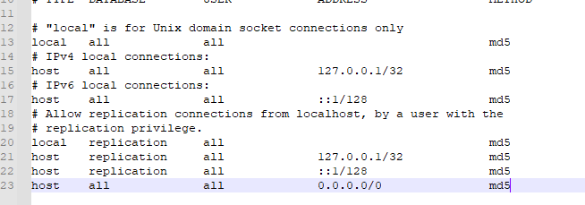

## SonarQube部署

### 下载windows安装包

下载地址：<https://binaries.sonarsource.com/Distribution/sonarqube/sonarqube-9.9.5.90363.zip>

### 编辑 SonarQube 配置

编辑配置文件&lt;PKG_DIR&gt;/conf/sonar.properties

1. 数据库连接  
   sonar.jdbc.username=&lt;JDBC_USERNAME&gt;  
   sonar.jdbc.password=&lt;JDBC_PASSWORD&gt;  
   sonar.jdbc.url=jdbc:postgresql://localhost/sonarqube
2. Elasticsearch 数据目录(可不修改保持默认)  
   sonar.path.data=&lt;DATA_DIR&gt;  
   sonar.path.temp=&lt;TMP_DIR&gt;
3. Web Server 地址(可不修改保持默认)  
   sonar.web.host=&lt;IP&gt;  
   sonar.web.port=&lt;PORT&gt;

如下图所示：

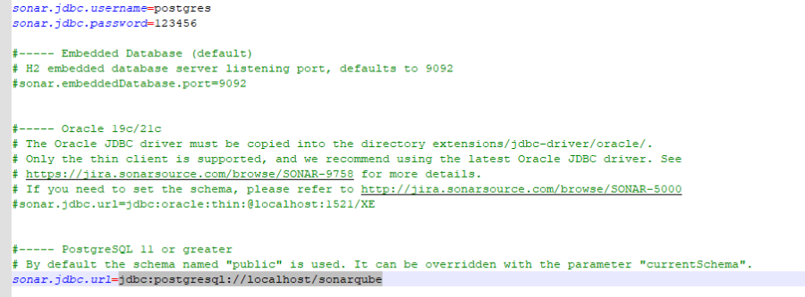

### 安装Community Branch Plugin

1. 下载sonarqube分支插件

下载地址：

<https://github.com/mc1arke/sonarqube-community-branch-plugin/releases/download/1.14.0/sonarqube-community-branch-plugin-1.14.0.jar>

2. 复制插件到sonarqube插件存放目录

&lt;PKG_DIR&gt;/extensions/plugins/

如下图所示：

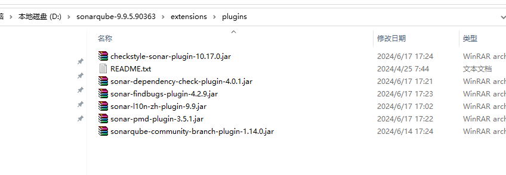

3. 修改sonarqube配置

修改sonar.web.javaAdditionalOpts

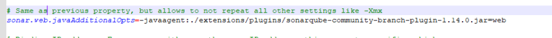

修改sonar.ce.javaAdditionalOpts

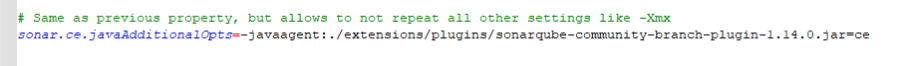

### 安装jdk-17

下载地址：

<https://download.oracle.com/java/17/latest/jdk-17_windows-x64_bin.zip>

增加SONAR_JAVA_PATH环境变量，指向已安装的jdk-17

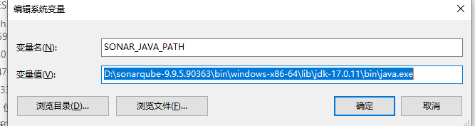

### 安装sonarqube服务

进入到&lt;PKG_DIR&gt;/bin/windows-x86_64/目录

执行命令SonarService.bat install

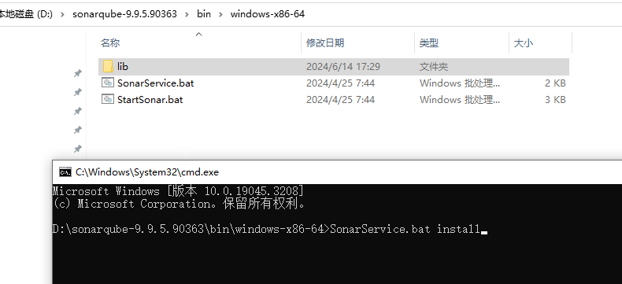

### 启动sonarqube

进入到&lt;PKG_DIR&gt;/bin/windows-x86_64/目录

执行命令SonarService.bat start

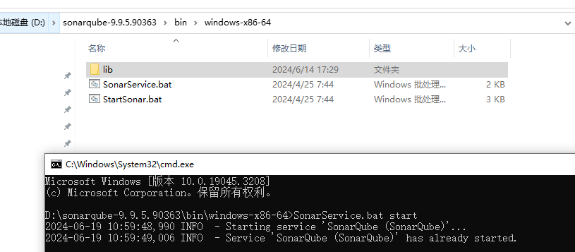

### 验证安装

1. 从外部机器访问 http://&lt;SONARQUBE_SERVER_IP&gt;:&lt;PORT&gt; 验证网页正常访问
2. 使用默认账户密码admin/admin登录并修改密码
3. 安装中若有任何问题，可以查看 SonarQube 目录下的 logs 目录中的日志文件

### 添加项目

在 SonarQube 中为 Bitbucket 的指定项目仓库添加关联的 SonarQube 项目，添加的项目将会有自己的项目标识（sonar.projectKey），将在后续扫描配置中会用到。

具体步骤如下（以 product-micro-base 的仓库为例）：

点击「手工」方式新增项目

- 「显示名」填写仓库名称，如 product-micro-base

- 「项目标识」填写 product-micro-base

- 「主分支名称」填写实际的主分支名称，如 master

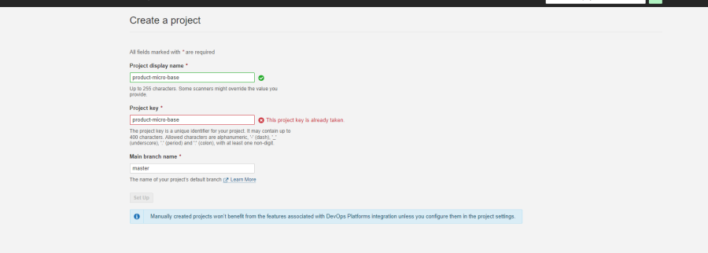

### 配置检查规则

1. 导航到SonarQube > Quality Gates，点击Create按钮
2. 输入规则名称

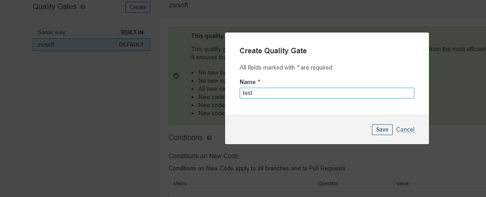

3. 修改规则

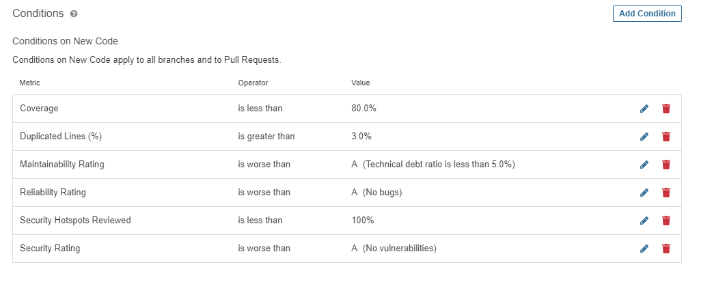

4. 点击Set as Default按钮

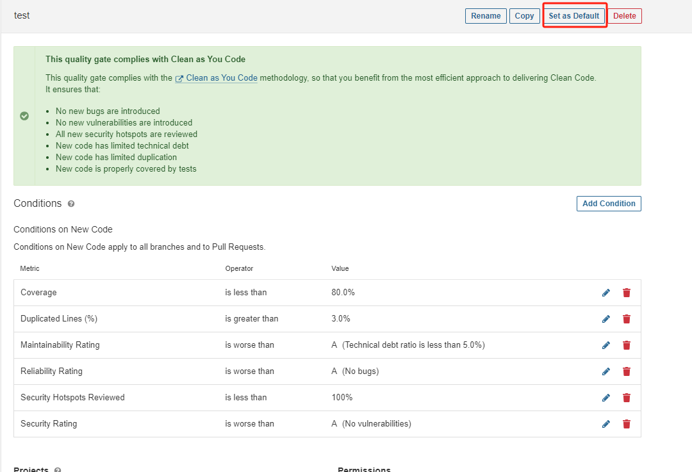

最终结果如下图所示：

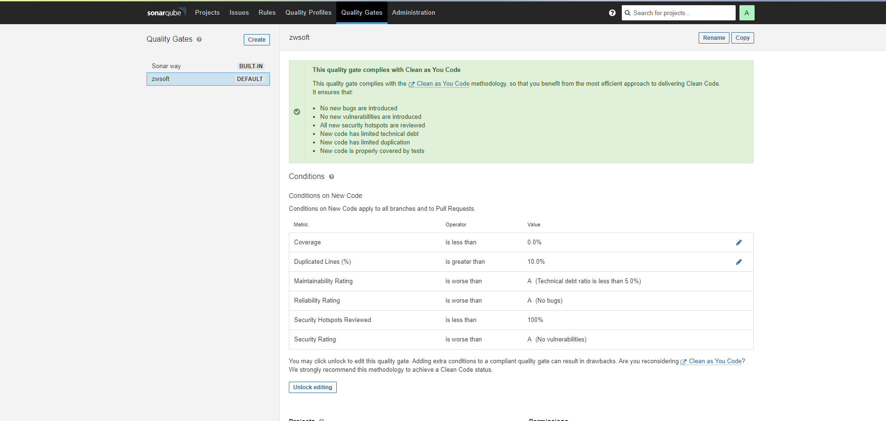

## Jenkins配置

### 安装 SonarQube Scanner插件

&nbsp;需要[Jenkins 2.11 或更高版本的 SonarQube 扩展。](https://plugins.jenkins.io/sonar/"%20\o%20"Jenkins%20的%20SonarQube%20扩展"%20\t%20"https://docs.sonarsource.com/sonarqube/latest/analyzing-source-code/ci-integration/jenkins-integration/global-setup/_blank)

步骤如下：

1. 在Jenkins Dashboard面板，导航到Manage Jenkins > Manage Plugins然后安装SonarQube Scanner插件。

如下图所示：

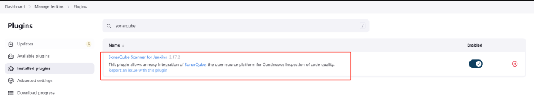

2. 单击Dashboard > System > Credentials的Add。

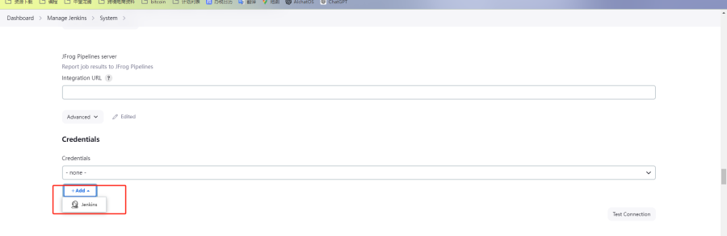

3. 单击Add Credentials并添加以下信息：

- Kind: Secret Text
- Scope: Global
- Secret: 在 SonarQube 中的用户 > My Account > Security处生成一个令牌  ，然后将其复制并粘贴到这里。

如下图所示：

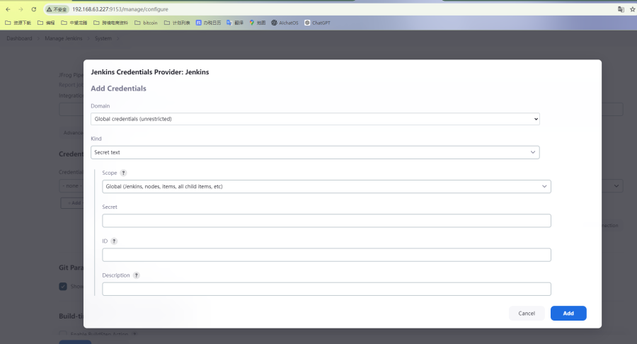

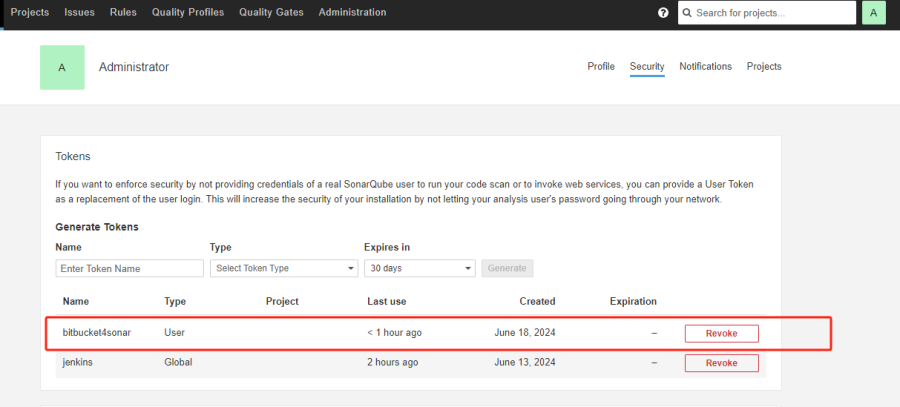

4. 单击 “确定”。
5. 从 Jenkins Dashboard，导航至 Manager Jenkins > System。
6. 在 SonarQube 服务器 部分中，单击 添加 SonarQube。添加以下信息：

- Name：为您的SonarQube实例提供一个唯一的名称。
- Server URL：您的 SonarQube 实例 URL。
- Sever authentication token：选择在步骤c中创建的凭证。
- 选中Environment Variables

如下图所示：

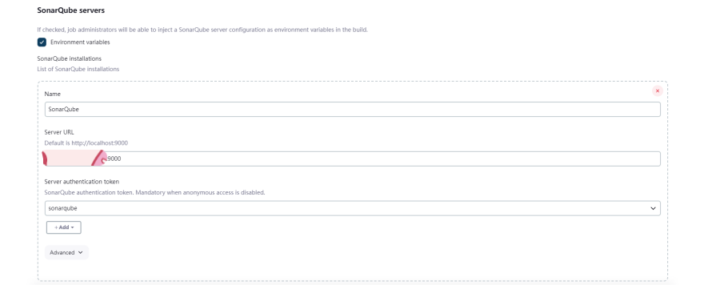

7. 点击“ 保存”

### [添加与项目匹配的jdk](#jdk)

从 Jenkins Dashboard，导航至 Manager Jenkins > Tools > JDK installations。

如下图jdk-11

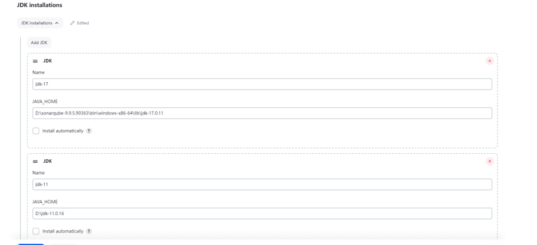

### 添加maven

从 Jenkins Dashboard，导航至 Manager Jenkins > Tools > Maven installations。

如下图

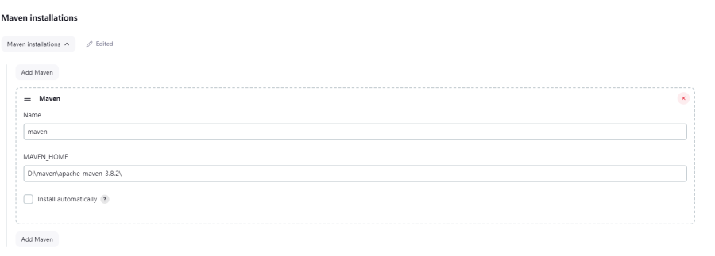

### 添加SonarQube Scanner

从 Jenkins Dashboard，导航至 Manager Jenkins > Tools > SonarQube Scanner installations。

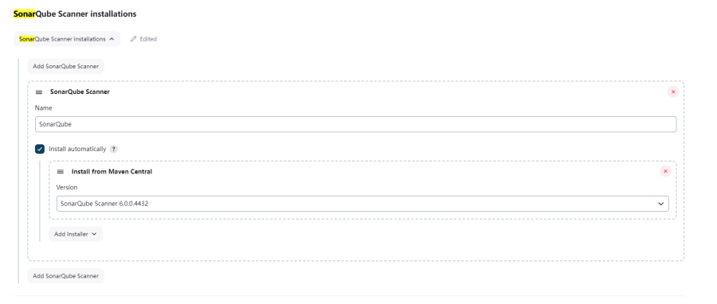

### 配置Bitbucket Server

需要[Bitbucket Branch Source 插件版本 2.7 或更高版本](https://plugins.jenkins.io/cloudbees-bitbucket-branch-source/"%20\o%20"Bitbucket%20Branch%20Source%20plugin"%20\t%20"https://docs.sonarsource.com/sonarqube/latest/analyzing-source-code/ci-integration/jenkins-integration/global-setup/_blank)

1. 从Jenkins Dashboard，导航至Manage Jenkins > Plugins 并安装 Bitbucket Branch Source 插件。

如下图所示：

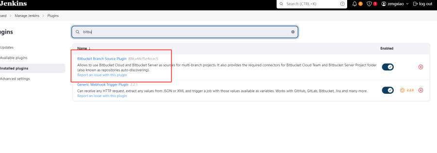

2. 配置Bitbucket Server

从 Jenkins Dashboard，导航至 Manage Jenkins > System。

在 Bitbucket Endpoints 部分中，单击 添加 下拉菜单并选择 Bitbucket Server。添加以下信息：

- Name：为您的 Bitbucket Server 实例指定一个唯一的名称。
- Server URL：您的 Bitbucket 服务器实例 URL。
- Server Version：您的 Bitbucket 服务器实例版本。

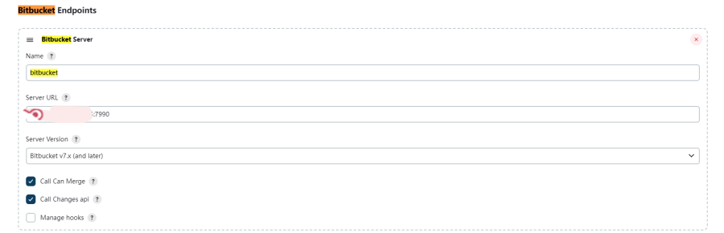

### 创建「多分支流水线」任务

1. 配置如下方图例所示
2. 对要执行静态代码扫描的项目仓库，确保每个分支具有相同的 Jenkinsfile 以保证 Jenkins 能够发现分支

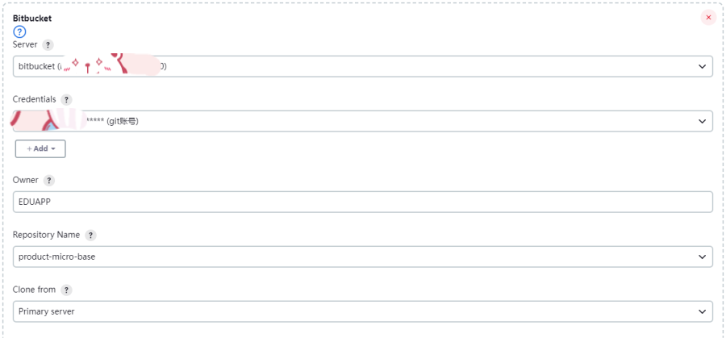

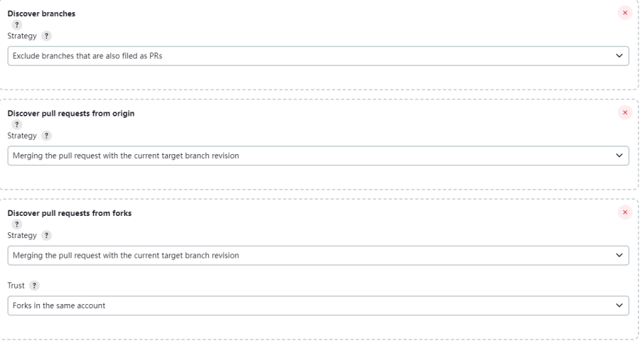

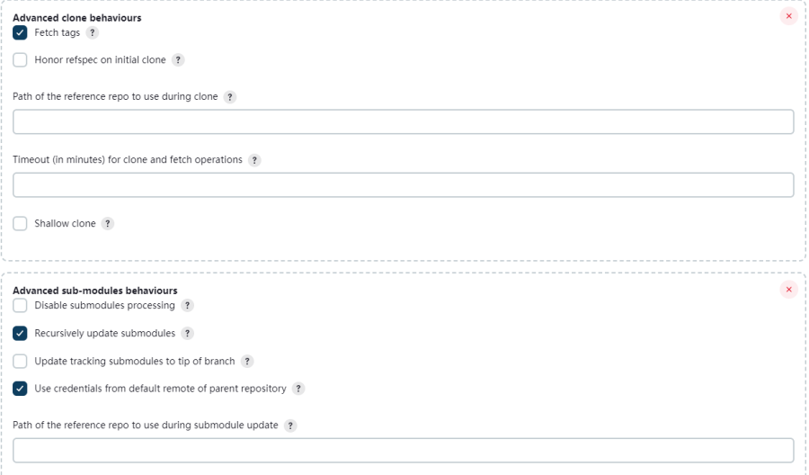

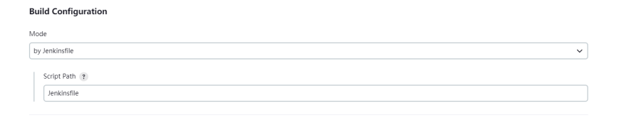

## Bitbucket配置

### 安装Include Code Quality for Bitbucket插件

注意：安装版本需要为6.0.5

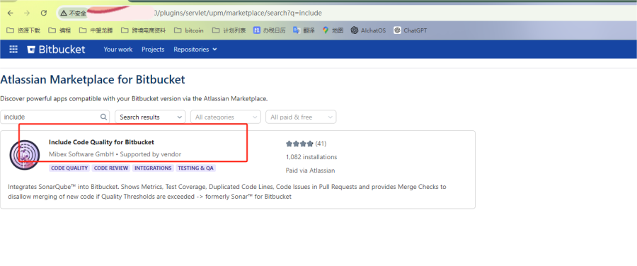

### 添加SonarQube服务器

- SonarQube服务器地址：SonarQube服务器地址
- 用户密钥：用户类型的token，具有管理员权限
- 不使用手动webhook配置

token与[安装 SonarQube Scanner](#_安装%20SonarQube%20Scanner)中配置的token一致。

千万要注意此token的类型需要时User

在SonarQube中安装Community Branch Plugin完成之后再添加到bitbucket

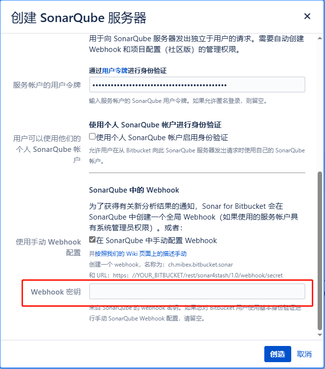

### 配置项目级别PR拦截

PR 拦截配置也遵循 Bitbucket 的配置分级规范，分为项目级别配置和仓库级别配置。

项目级别配置步骤：

1. 点击「Project settings」
2. 在「ADD-ONS」中点击「Sonar」
3. 在「Merge Checks」中勾选「Use SonarQube Quality Gates as Pull Request Merge Checks」选项
4. 其他按需配置即可

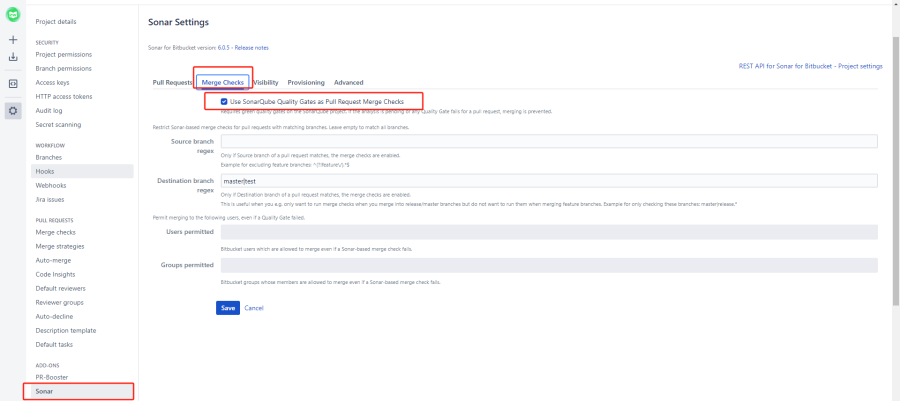

### 配置webhook

1. 打开相应项目仓库，进入 Repository settings -> Webhooks 准备创建触发 Jenkins 的 Webhook
2. 「Name」字段自定义填写
3. 「URL」字段填写 http://&lt;JENKINS_URL&gt;/bitbucket-scmsource-hook/notify?server_url=&lt;BITBUCKET_URL&gt; 作为触发地址
4. 在「Events」中勾选：

- 「Repository」的「Push」

- 「Pull request」的「Opened」、「Source branch updated」、「Modified」

5. 点击「保存」按钮

如下图所示：

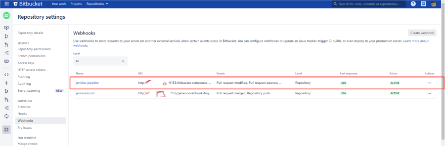

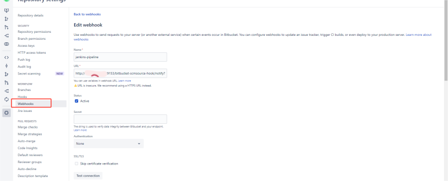

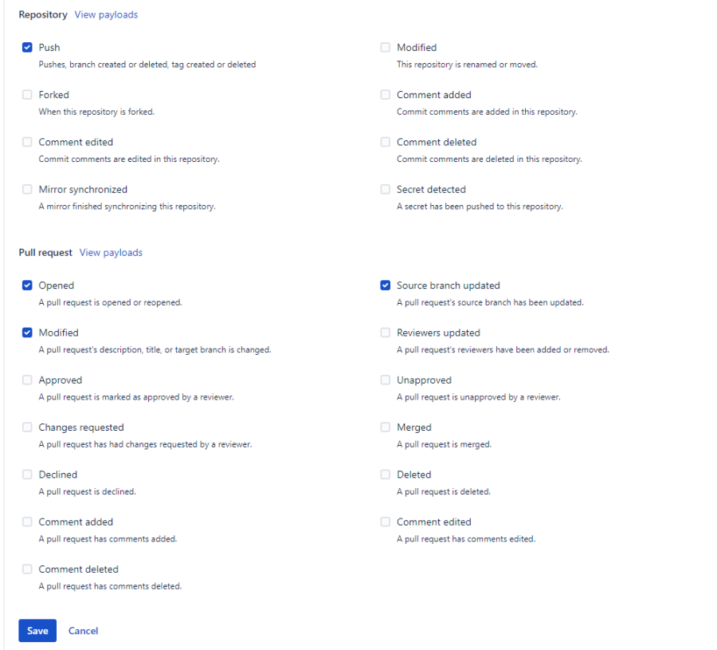

### SonarQube项目配置

1. 点击「Repository settings」
2. 在「ADD-ONS」中点击「Sonar」
3. 选择对应的 SonarQube 项目（需先由 Bitbucket 管理员在配置中添加 SonarQube 服务器，此处才能列出已有的 SonarQube 项目）
4. 如无特殊配置，「Inherit settings」可选择「Inherit from Project settings」

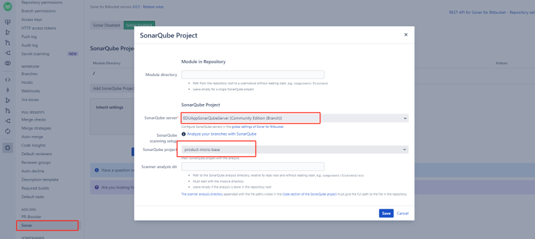

### 质量检测失败时拒绝PR合并(非必须)

设置拉取请求分析后，如果拉取请求未通过质量检测，您可以阻止其合并。具体操作如下：

在 Bitbucket Server 中，导航到Repository Settings  >  Code Insights

- projectKey:  &lt;projectKey in SonarQube project&gt;

需要和步骤5中选择的SonarQube项目的projectKey一致

如：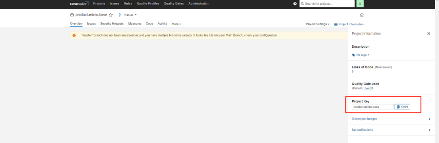

- Required status: MUST PASS
- Annotation requirements: Must not have high severity annotations

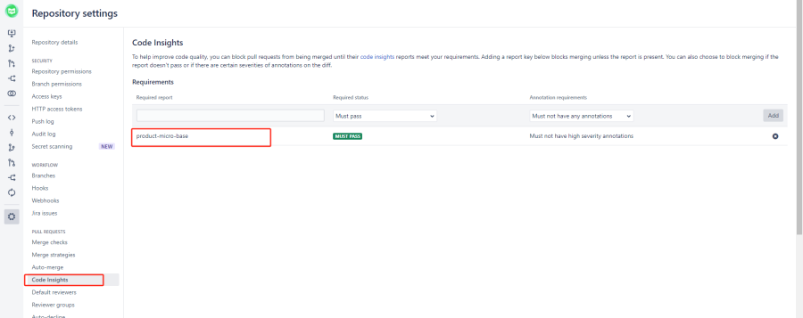

## 项目配置

### 在项目添加Jenkinsfile文件

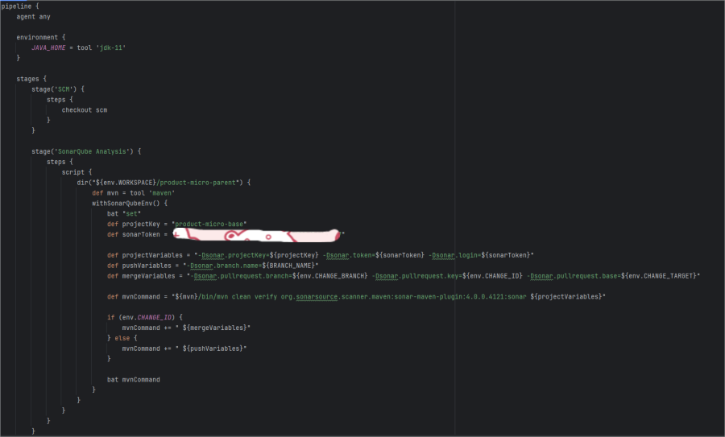

### 脚本解释


```groovy

pipeline {
    // 使用任意SonarQube Scanner节点进行扫描
    agent any

    environment {
         // 配置扫描的jdk版本,与[添加与项目匹配的jdk]中的名称一致
        JAVA_HOME = tool 'jdk-11'
    }

    stages {
        // 步骤1,拉取代码
        stage('SCM') {
            steps {
                // 拉取代码
                checkout scm
            }
        }
        // 步骤2,代码质量检测
        stage('SonarQube Analysis') {
            steps {
                script {
                    // 进入到子目录
                    dir("${env.WORKSPACE}/product-micro-parent") {
                        // 获取maven安装路径
                        def mvn = tool 'maven'
                        withSonarQubeEnv() {
                            // 打印环境变量
                            bat "set"
                            // 定义SonarQube项目的projectKey
                            def projectKey = "product-micro-base"
                            // 定义sonar身份认证token
                            def sonarToken = "sqa_5dac3dcc5251173b27f77876228d728d3dd853a7"
                            // 项目相关参数配置
                            def projectVariables = "-Dsonar.projectKey=${projectKey} -Dsonar.token=${sonarToken} -Dsonar.login=${sonarToken}"
                            // git push相关参数
                            def pushVariables = "-Dsonar.branch.name=${BRANCH_NAME}"
                            // git pull request相关参数
                            def mergeVariables = "-Dsonar.pullrequest.branch=${env.CHANGE_BRANCH} -Dsonar.pullrequest.key=${env.CHANGE_ID} -Dsonar.pullrequest.base=${env.CHANGE_TARGET}"
                            // maven插件执行命令
                            def mvnCommand = "${mvn}/bin/mvn clean verify org.sonarsource.scanner.maven:sonar-maven-plugin:4.0.0.4121:sonar ${projectVariables}"
                            // 判断git命令类型
                            if (env.CHANGE_ID) {
                                // 如果是git pull request
                                mvnCommand += " ${mergeVariables}"
                            } else {
                                // 如果是git push
                                mvnCommand += " ${pushVariables}"
                            }
                            // 执行SonarQube Scanner扫描
                            bat mvnCommand
                        }
                    }
                }
            }
        }
    }
}

```