# 微服务性能优化

## 优化结果

|网关 |99%| 90%| 75%| 50%| 最大| 最小 |平均| TPS|
|---|---|---|---|---|---|---|---|---|
|优化前 |6328| 5471| 4839| 3941| 10116| 119 |3844.39 | 783|
|优化后| 3174 |2829| 2431| 1403| 6451| 53| 1583.45   | 1042|

## 问题分析工具

- 阿里云性能测试PTS
- JMeter
- arthas
- jstat -gc
- jinfo
- 阿里云ARMS
  - arthas + java agent
- 阿里云性能测试PTS
  - 基于JMeter，使用多服务器（外网/内网）、常用流量模型同时并发测试。相对于JMeter来说测试结果更加客观
    - 主要功能：
      - 采样日志
      - 平均RT
      - Prometheus监控
  
  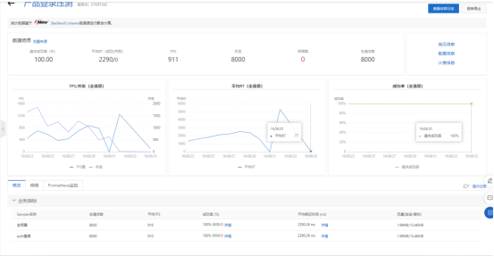
  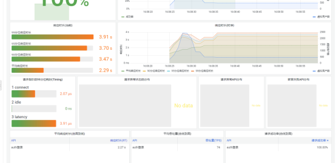
  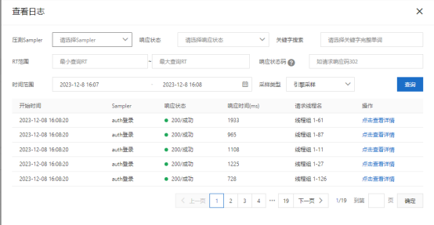

### arthas

#### trace

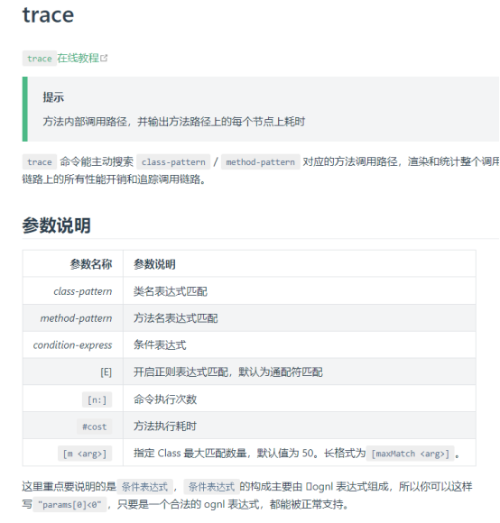

主要通过trace进行方法追踪，添加额外条件排除过多的信息输出，主要过滤条件: cost
例：

```shell

trace com.zwsoft.oauth2.server.controller.BaseUserController token  '#cost > 1000'

```

即过滤BaseUserController的token接口，只显示耗时大于1s的调用

##### trace原理

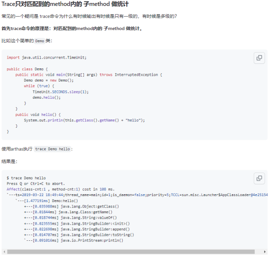
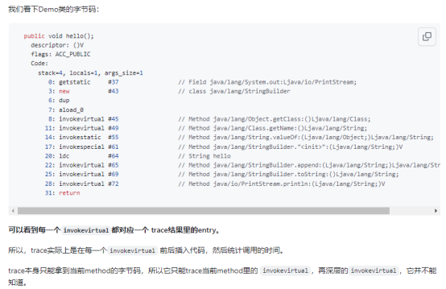

###### trace的局限性及解决办法

###### 局限性

- trace只会匹配到函数里面的子调用，并不会向下trace多层。

###### 解决办法

- trace多个类或函数
- 动态trace
  - 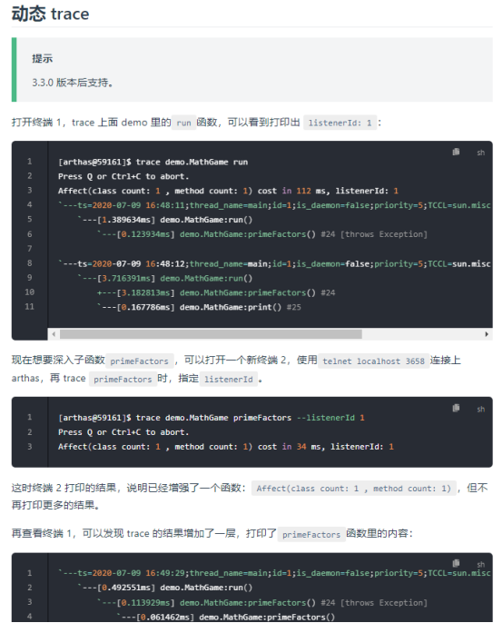

#### profiler

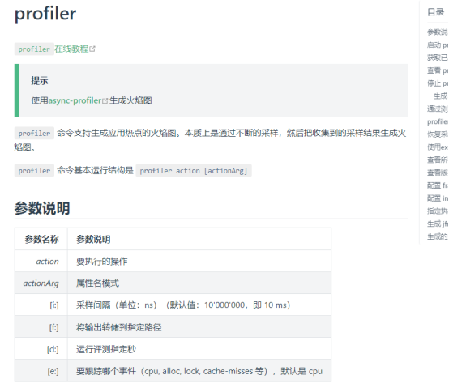

##### 生成火焰图

- 开启火焰图

```shell

profiler start

```

- 性能压测

- 保存火焰图

```shell

profiler stop --format html

```

- 分析火焰图

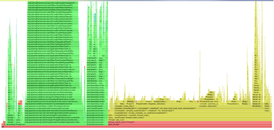

- 绿色部分代表Java代码
- 黄色部分代表JVM C++代码
- 橙色部分代表内核态C语言代码
- 红色代表用户态C语言代码

##### 火焰图怎么看

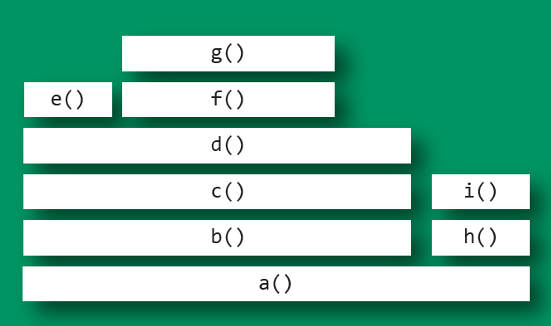

- 上面图片中，最顶层的函数g()占用 CPU 时间最多。d()的宽度最大，但是它直接耗用 CPU 的部分很少。b()和c()没有直接消耗 CPU。因此，如果要调查性能问题，首先应该调查g()，其次是i()。
- 另外，从图中可知a()有两个分支b()和h()，这表明a()里面可能有一个条件语句，而b()分支消耗的 CPU 大大高于h()

1. 这里的x轴代表采样总量（也就是此刻所有执行的耗时cpu的方法）。
这是注意的是x 轴并不代表时间，而是所有的调用方法合并后，按字母顺序排列。
2. Y轴代表方法的调用栈深度，每一层都是一个方法。顶部是正在执行的方法。当然调用栈越深，火焰就越高。
3. 鼠标可以点击的选中的每个框就代表了一个栈里的函数，其宽度可以直接理解为CPU时间占比（其实是采样的数量以及与采样总量的占比）。

那么，也就是说占比比较宽的框就表示：
    - 该函数运行时间较长（单次时间长）
    - 被调用次数较多.（调用频率高）进而被采样的次数比较多，占用的CPU时间多。

参考：<https://ruanyifeng.com/blog/2017/09/flame-graph.html>

#### jstat

jdk自带的分析工具，也可使用visual vm图形工具查看

visual vm  
    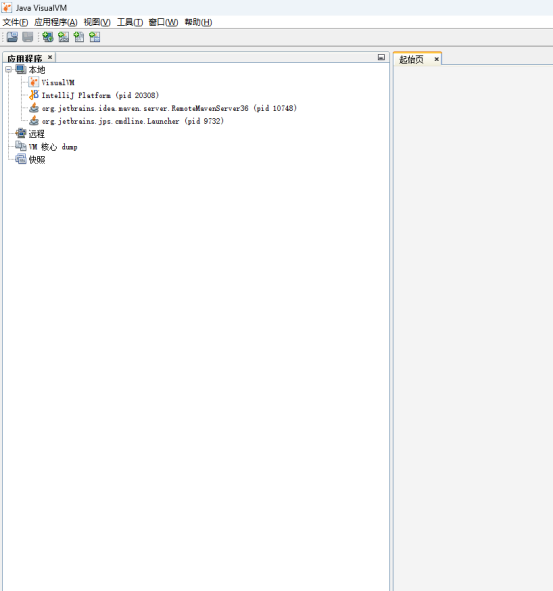

jstat -gc  
    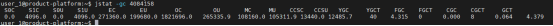

- S0C：年轻代中第一个Survivor区的容量，单位为KB。
- S1C：年轻代中第二个Survivor区的容量，单位为KB。
- S0U：年轻代中第一个Survivor区已使用大小，单位为KB。
- S1U：年轻代中第二个Survivor区已使用大小，单位为KB。
- EC：年轻代中Eden区的容量，单位为KB。
- EU：年轻代中Eden区已使用大小，单位为KB。
- OC：老年代的容量，单位为KB。
- OU：老年代已使用大小，单位为KB。
- MC：元空间的容量，单位为KB。
- MU：元空间已使用大小，单位为KB。
- CCSC：压缩类的容量，单位为KB。
- CCSU：压缩类已使用大小，单位为KB。
- YGC：Young GC的次数。
- YGCT：Young GC所用的时间。
- FGC：Full GC的次数。
- FGCT：Full GC的所用的时间。
- CGTC：并发总垃圾收集。
- CGC：并发垃圾收集。
- GCT：GC的所用的总时间。

##### 主要关注指标

- EC
- EU
- OC
- OU
- MC
- MU
- YGC
- YGCT
- FGC
- FGCT
- CGTC
- CGC
- GCT

### 性能分析过程

---

#### 认证服务

平台登录接口压测RT长，认证服务器无波动

##### 优化过程

###### 优化前

登录入口：

```java

OAuth2TokenEndpointFilter.doFilterInternal

```

大致流程如下：

  1. 验证客户端凭证（框架实现）
  2. 查询数据库（自定义实现）
  3. 验证用户凭据（框架实现）
  4. 生成并保存token（自定义实现）
  5. 登录成功之后逻辑，清空登录错误计数器、存储token（自定义实现）

优化过程：

- 首先增加实例
  1. 优化结果：性能提升不大

- 添加数据库缓存
  1. 优化结果：性能提升不大

- 平台压测无异常，认证服务只有少量日志。查看nginx，大量连接被拒绝。
  1. 问题原因：nginx连接数默认为1024，远低于并发数
  2. 优化措施：调整nginx连接数及内核连接句柄参数
  3. 优化结果：请求能正常分发到认证服务，大量失败请求（70%）

- 阿里云性能测试PTS采样日志出现code为500的请求
  1. 问题原因：由于gateway中使用了WebClient进行接口转发，其队列只有1000，导致大量请求排队
  2. 优化措施：调整队列参数
  3. 优化结果：性能提升不大

- 阿里云性能测试PTS采样日志出现code为500的请求
  1. 优化措施：去除gateway中WebClient转发，通过修改请求地址进行loadbalance直接转发
  2. 优化结果：没有code为500的请求，单接口仍大量失败

- 通过arthas排查OAuth2TokenEndpointFilter.doFilterInternal接口调用
  1. 观测到耗时较长的代码：清空登录错误计数器耗时较长
  2. 优化措施：内存队列异步批量写入，超限+定时
  3. 优化结果：性能提升不大

- 再次通过arthas排查OAuth2TokenEndpointFilter.doFilterInternal接口调用
  1. 观测到耗时较长的代码：生成并保存token
  2. 优化措施：不保存token、使用非加密token
  3. 优化结果：性能提升不大

- 观测GC
  1. 优化措施：增加堆内存
  2. 优化结果：性能提升不大

- 调整jdbc、redis连接数
  1. 优化结果：性能提升不大

- 平台nacos报错
  1. 优化措施：改用nacos集群
  2. 优化结果：性能提升不大

**优化至此，项目中的代码性能很小，另外微信公众平台的token授权接口也说明“不允许压力测试”，初步怀疑是框架导致的。**

- 最终优化
  1. 优化措施：提取框架代码，增加新的登录接口BaseUserController.token
  2. 优化结果：性能提升超过100%，认证接口压测由20+降低到1.5s

**框架层面的问题用arthas trace没有太好的办法进行调试，特别是reactor项目，例如Spring-Cloud-Gateway、Spring-WebFlux。**

---

#### 网关

直接压测认证登录接口，响应时间RT 1.5s，经过网关压测，响应时间4s+。

##### 网关优化过程

- trace AuthorizationController.filter
  1. 方法耗时极短，无法确认性能卡点

- trace GlobalFilter.filter
  1. 方法耗时极短，无法确认性能卡点

- trace DispatcherHandler.handle
  1. 方法耗时短，无法确定卡点

- profiler查看火焰图  
  自定义代码耗时短，但火焰高度很高，初步怀疑是调用栈深度导致
  - 优化措施  
    去除所有自定义代码及oauth2相关依赖，使用原始的gateway及spring-security
    1. 测试结果：RT降低到2.2s左右

  - 优化措施：去除oauth2相关依赖  
    去除spring-boot-starter-oauth2-client  
    去除spring-boot-starter-oauth2-resource-server  
    基于Spring-Security自定义token鉴权AccessManager  
    1. 优化结果：RT降低到2.8s左右

  - 优化措施：优化自定义代码实现，减少GlobalFilter  
    去除ip白名单、接口黑名单功能  
    优化接口白名单地址匹配器由AntPathMatcher更改为自定义的PathPatternMatcher。AntPathMatcher功能更加强大，但是匹配逻辑更加复杂。  
    关闭XssFilter  
    1. 优化结果：RT降低到1.6s，火焰明显降低

**至此，代码优化基本结束，与原始的Spring-Cloud-Gateway性能相差不大。**
期间尝试过调整netty的Boss和Worker线程数、 redis连接池、Gateway的http-client连接池，性能影响不大。
