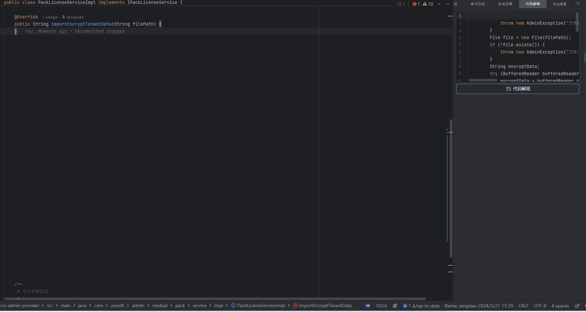
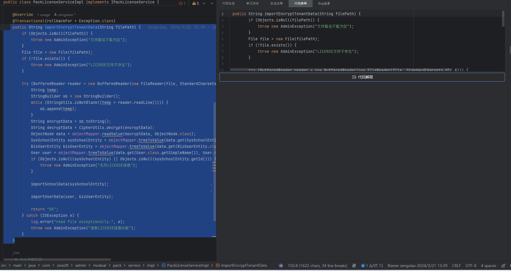
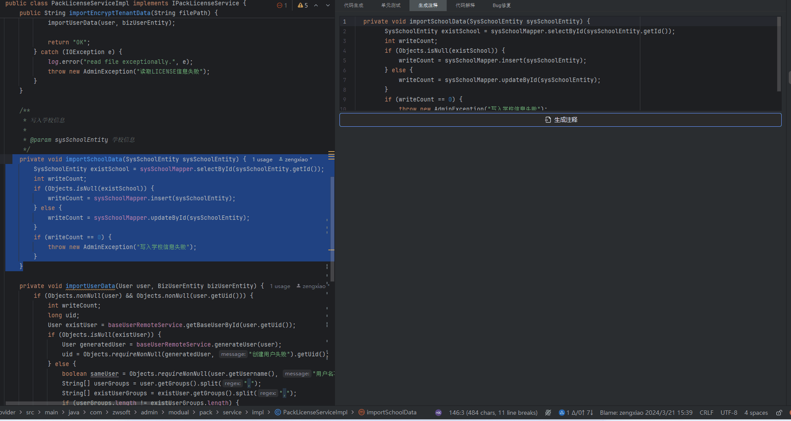
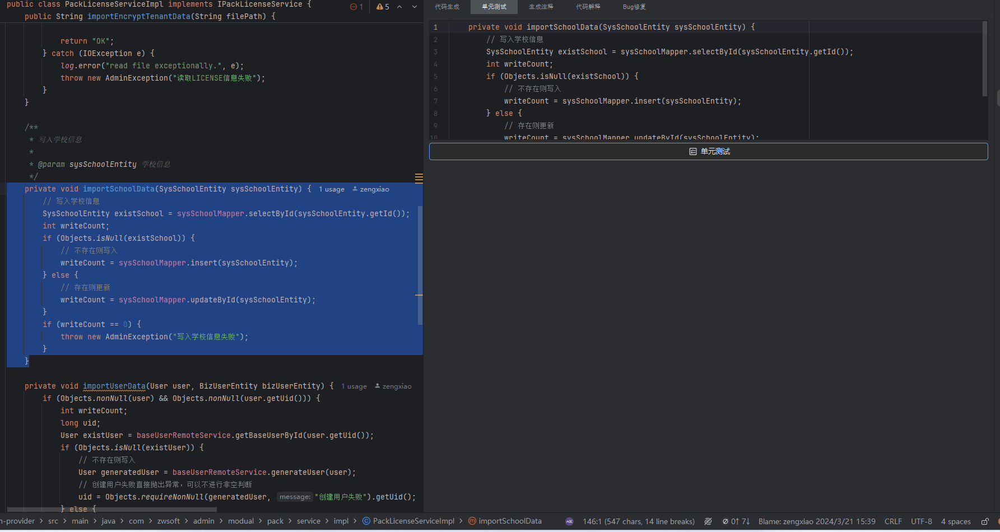
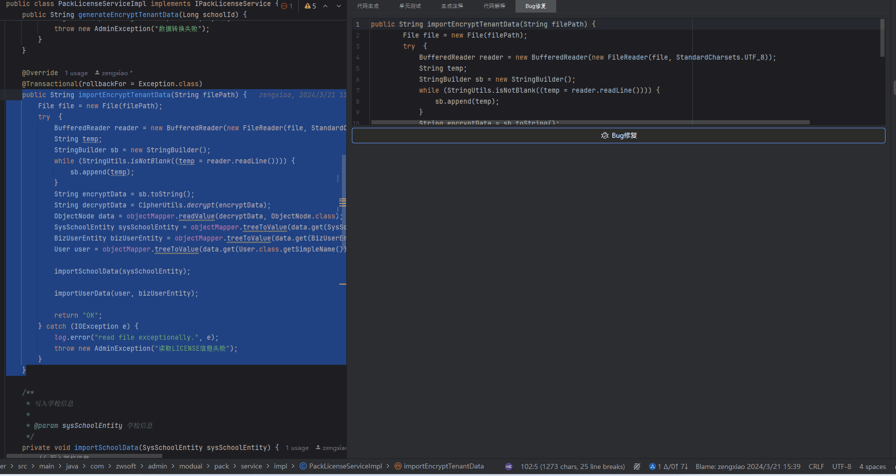
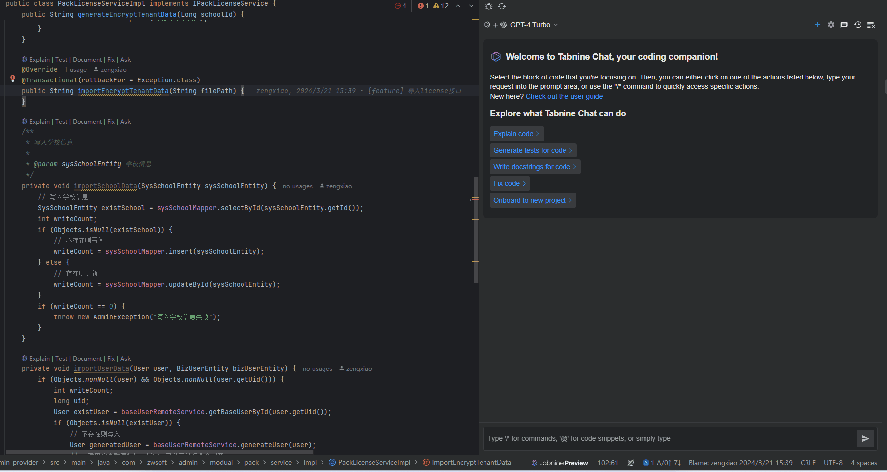
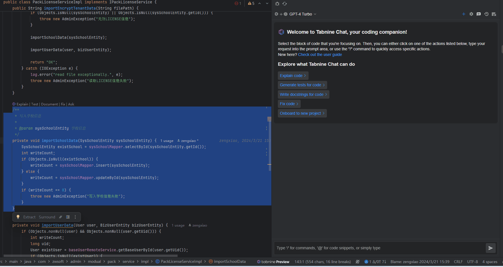
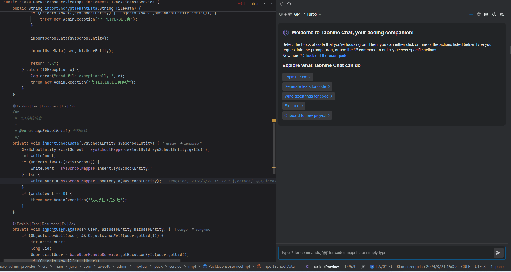
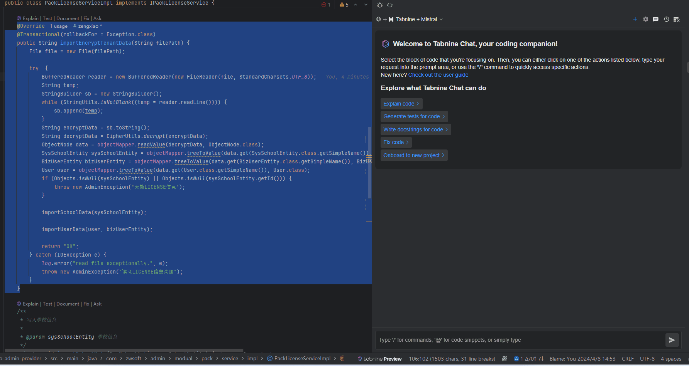

# AI效率提升

## 免费编程插件

### aiXcoder

#### 支持的语言

Java、Python、C++、C、JavaScript、TypeScript、HTML、CSS、JSX、TSX、Vue

#### 支持的IDE

IntelliJ IDEA、CLion、GoLand、 PyCharm、 WebStorm、Visual Studio Code、Eclipse

#### 支持的功能

- 代码生成
- 生成单元测试
- 生成注释
- 代码解释
- 代码问题修复

#### 特点

- 支持本地LLM模型

#### 示例

##### ****代码生成****

##### ****代码解释****

##### ****生成注释****

##### ****生成单元测试****

##### ****代码问题修复****

### Tabnine: AI Code Completion & Chat in Java JS/TS Python & More

#### 支持的语言

the most popular coding languages

#### 支持的IDE

IntelliJ IDEA (Ultimate, Community)、 Android Studio,、AppCode、 Aqua、 CLion、 Code With Me Guest、 DataGrip、 DataSpell、 GoLand、 JetBrains Client、 JetBrains Gateway、 MPS、 PhpStorm、 PyCharm (Professional, Community)、 Rider、 RubyMine、 RustRover、 WebStorm、VSCode

#### 局限性

需要翻墙

#### 支持的功能

- 代码解释
- 生成单元测试
- 生成注释
- 代码问题修复

#### 特点

- 支持大多数语言
- 支持多种LLM模型

| Tabnine + Mistral | 速度快 | 代码私有 | 无安全保护 |
| --- | --- | --- | --- |
| Tabnine | 速度中等 | 代码私有 | 安全保护 |
| Tabnine + GPT-3.5 Turbo | 速度快 | 代码公开 | 无安全保护 |
| Tabnine + GPT-4 Turbo | 速度快 | 代码公开 | 无安全保护 |

#### 示例

##### ****代码生成****

##### ****代码解释****

##### ****生成注释****

##### ****生成单元测试****

##### ****代码问题修复****

### ****插件对比****

| **插件** | **代码生成** | **代码解释** | **代码注释** | **单元测试** | **代码修复** |
| --- | --- | --- | --- | --- | --- |
| aiXcoder | 正确率高一些 | 正确  | 行级注释 | 单元测试简单 | 能够识别修复的问题多一些 |
| Tabnine | 正确率一般 | 正确且详细 | 仅doc注释 | 单元测试涵盖多种异常情况 | 关闭输入流未识别到 |

## 辅助工具

### AIChatOS

#### 访问地址

<https://chat18.aichatos.xyz/>

### screenshot-to-code

#### 源码地址

<https://github.com/abi/screenshot-to-code>

## 可能的应用场景

- AI企业应用服务集成

- DevOps自动化流程集成AI工具做代码静态检查、质量分析